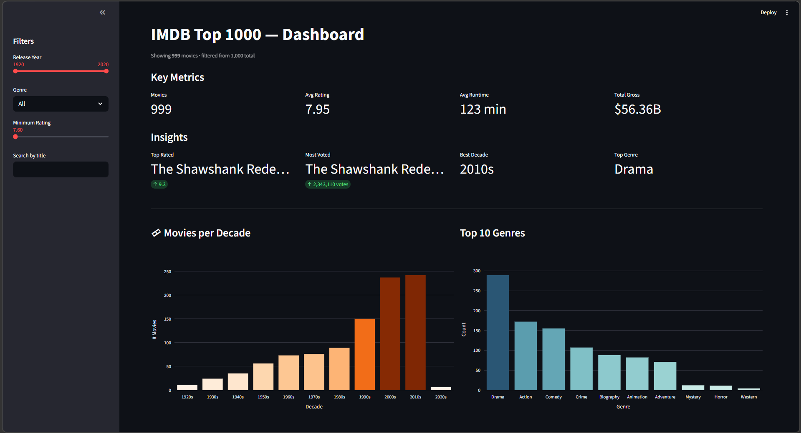
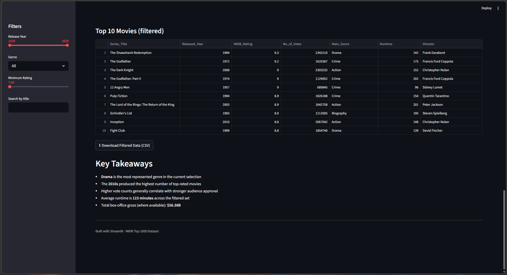
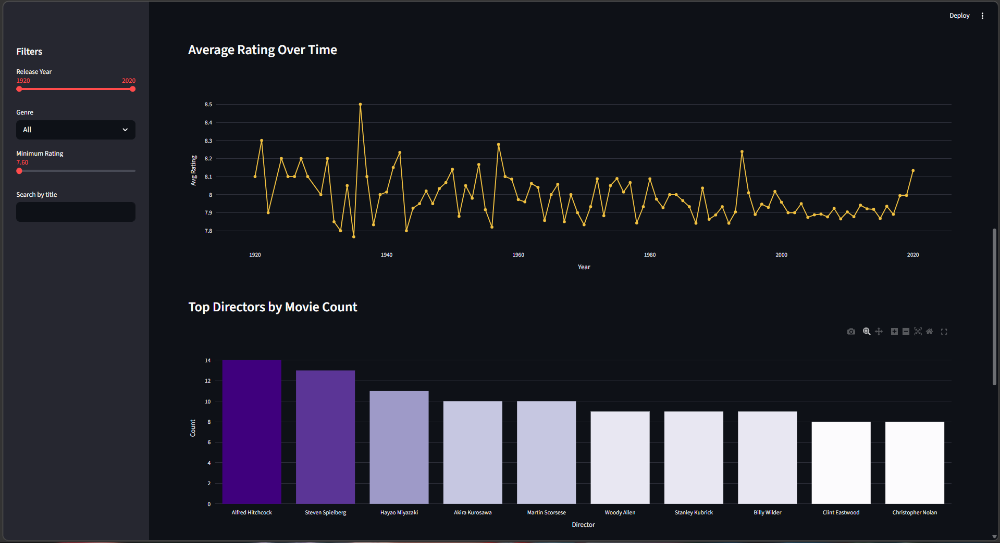
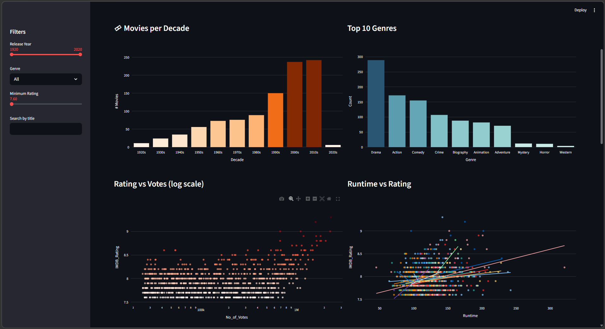

# IMDB Top 1000 Dashboard

An interactive data visualization dashboard built using **Streamlit**, showcasing insights from the IMDB Top 1000 movies dataset.
This project allows users to explore trends, filter movies, and analyze patterns across ratings, genres, and time.

---

## Features

* Interactive dashboard with real-time filtering

* Filters by:

  * Release year range
  * Genre
  * Minimum rating
  * Movie title search

* Visualizations:

  * Movies per decade
  * Top genres
  * Rating vs votes
  * Runtime vs rating (with trendline)
  * Average rating over time

* Key metrics:

  * Average rating
  * Average runtime
  * Total gross revenue

* Insights:

  * Top-rated movie
  * Most voted movie
  * Best decade
  * Most popular genre

* Download filtered dataset as CSV

---

## Project Structure

```
IMDB-Dashboard/
|
├── streamlit_app.py     # Main dashboard application
├── imdb_top_1000.csv   # Dataset file
└── README.md
```

---

## Concepts Used

* Streamlit for building interactive web apps

* Pandas for data cleaning and manipulation

* Plotly Express for data visualization

* Data preprocessing:

  * Handling missing values
  * Extracting numeric values from strings
  * Feature engineering (Decade, Main Genre)

* Basic statistical analysis and aggregation

* UI/UX enhancements using custom styling

---

## How to Run

### 1. Clone Repository:

```bash
git clone https://github.com/Shroojan2076/IMDB-Dashboard.git
```

### 2. Navigate into the folder:

```bash
cd IMDB-Dashboard
```

### 3. Install dependencies:

```bash
pip install streamlit pandas plotly statsmodels
```

### 4. Place dataset:

Ensure `imdb_top_1000.csv` is in the same directory.

### 5. Run the app:

```bash
streamlit run streamlit_app.py
```

---

## Preview

* Clean UI with key metrics and insights


* Interactive dashboard with sidebar filters


* Dynamic charts updating based on user input


---

## Design Highlights

* **Interactive filtering system** for real-time data exploration
* **Clean and responsive layout** using Streamlit columns
* **Efficient data caching** with `@st.cache_data`
* **User-friendly metrics display** for quick insights
* **Dynamic visualizations** powered by Plotly
* **Robust error handling** for missing datasets or invalid inputs

---

## Author

Built by **Shroojan Dhok**
